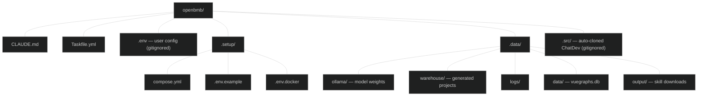
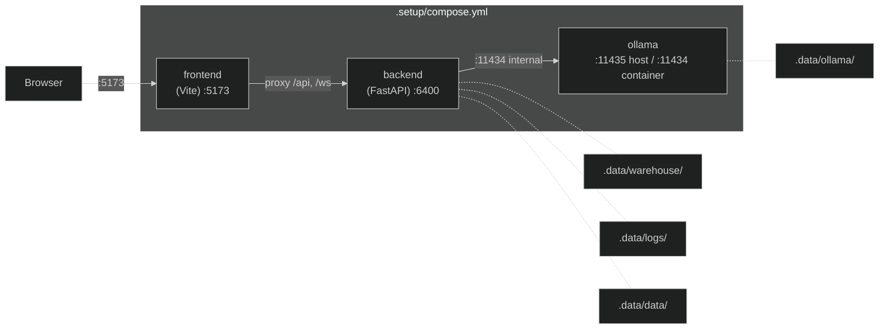

# ChatDev Docker Sandbox

## Quick Start

```bash
task setup        # create .env from template (one-time)
task up           # build, start all services, pull default model
```

Open http://localhost:5173 to use ChatDev.

## Current State (2026-02-18)

All services operational. Default model: `qwen3-coder-next` (51GB).

| Service | Container | Status | URL |
|---|---|---|---|
| Frontend (Vite + Vue 3) | chatdev_frontend | running | http://localhost:5173 |
| Backend (FastAPI) | chatdev_backend | healthy | http://localhost:6400 |
| Ollama (LLM serving) | chatdev_ollama | healthy | http://localhost:11435 |

Models loaded:
- `qwen3-coder-next:latest` (51 GB) -- default
- `qwen2.5-coder:7b` (4.7 GB) -- previous default, still cached

---

## Task Commands

```bash
# --- Lifecycle ---
task setup              # create .env from template (one-time)
task up                 # clone .src/ (if needed) + build + start + pull model + clean workflows
task down               # stop all containers
task restart            # stop + delete .src/ + re-clone + rebuild + start (clean slate)
task ps                 # show running services

# --- Source ---
task clone              # clone ChatDev into .src/ (no-op if present)
task reclone            # delete .src/ and re-clone fresh

# --- Logs ---
task logs               # tail all services
task logs:backend       # tail backend only
task logs:ollama        # tail ollama only

# --- Debug ---
task shell              # bash into backend container

# --- Ollama Models ---
task ollama:list        # list pulled models
task ollama:pull        # pull default model (qwen3-coder-next)
task ollama:pull-custom -- <model>   # pull any model by name

# --- Workflow Cleanup ---
task clean-workflows    # remove all sample workflows (team creates fresh ones per task)

# --- Maintenance ---
task validate           # validate YAML workflow files
task sync               # sync Vue graphs to DB
task clean              # stop + wipe all .data/ (with confirmation)
```

---

## Claude Code Skill

One entry point: `/chatdev [prompt]`. This spawns a multi-agent team that designs
a custom workflow from scratch, executes it, and delivers results.

| Command | What it does |
|---|---|
| `/chatdev [prompt]` | Spawn a CTO-led team to build anything — software, games, visualizations, research |

### Team Architecture

```
/chatdev "A space shooter with power-ups"
  │
  ▼
CTO (main Claude session)
  ├── architect  — designs a custom workflow YAML tailored to the task
  ├── engineer   — executes the workflow via the ChatDev API, collects artifacts
  └── reviewer   — QAs the output, summarizes results for the user
```

Workflows are created from scratch every time — no pre-existing templates or sample
workflows are assumed. The architect has the full YAML schema baked into its agent
definition and designs the optimal graph for each task.

```
.claude/
├── agents/
│   ├── architect/AGENT.md   <- workflow YAML designer
│   ├── engineer/AGENT.md    <- API/WS executor
│   └── reviewer/AGENT.md    <- output QA
└── skills/
    └── chatdev/SKILL.md     <- CTO entry point (spawns team)
```

---

## Architecture



### Service Diagram



### Networking

| From | To | URL |
|---|---|---|
| Browser | Frontend (Vite) | `http://localhost:5173` |
| Vite proxy (`/api`, `/ws`) | Backend | `http://backend:6400` (Docker internal) |
| Backend | Ollama | `http://ollama:11434/v1` (Docker internal) |
| Backend | External APIs | Outbound HTTPS (only if configured in `.env`) |

The frontend uses **relative URLs** (`/api/...`). Vite's dev server proxies these
to the backend container. The browser never talks to port 6400 directly.

---

## Constraint

**`.src/` is ephemeral and disposable.** It is auto-cloned from
`https://github.com/OpenBMB/ChatDev.git` by `task up` (or `task clone`).
`task restart` deletes and re-clones it for a clean slate. Never commit
changes to `.src/` — all customization lives in `.setup/`, `.env`, and
`Taskfile.yml`.

---

## Configuration

### .env (user-facing, at project root)

```env
# Default: containerized Ollama
BASE_URL=http://ollama:11434/v1
API_KEY=ollama

# Alternative: host Ollama
# BASE_URL=http://host.docker.internal:11434/v1

# Alternative: OpenAI
# BASE_URL=https://api.openai.com/v1
# API_KEY=sk-...

# Model name — used by workflow YAMLs as ${MODEL_NAME}
MODEL_NAME=qwen3-coder-next

# Ollama container port on host (default 11435 to avoid conflict with host Ollama)
OLLAMA_HOST_PORT=11435
```

### Key design details

- **Taskfile.yml** uses a `DC` variable for all docker compose commands:
  `docker compose -f .setup/compose.yml --env-file .env`
- **Volumes are bind mounts** to `.data/`, not named Docker volumes. Data is
  directly visible on the host filesystem.
- **Ollama host port defaults to 11435** to avoid conflict if Ollama is already
  running on the host at 11434.
- **Ollama memory limit is 64GB** to accommodate large models like qwen3-coder-next.
- **Backend has resource limits**: 2 CPUs, 4GB RAM, 256 PIDs.
- **`MODEL_NAME`** env var is used by the architect agent when designing workflows.
  It bakes `${MODEL_NAME}` into YAML node configs so the backend resolves it at runtime.
- **`task clean-workflows`** runs on `task up` to remove all sample workflows.
  The architect creates fresh, task-specific workflows from scratch.

---

## Issues Found & Fixed During Setup

1. **GPU driver error**: `could not select device driver "default" with capabilities: [[gpu]]`
   - Removed `deploy.resources.reservations.devices` from ollama service.
     GPU passthrough requires nvidia-container-toolkit on the host.

2. **Ollama healthcheck fails**: `curl: not found` in ollama/ollama image.
   - Changed healthcheck to `["CMD", "ollama", "list"]`.

3. **Port 11434 conflict**: Host Ollama already bound to 11434.
   - Default host port changed to 11435 via `${OLLAMA_HOST_PORT:-11435}:11434`.

4. **Frontend 500 errors on /api/workflows and /api/config/schema**:
   - Root cause: `VITE_API_BASE_URL` was `http://localhost:6400`. The Vite dev server
     (inside the frontend container) uses this as the proxy target. Inside the container,
     `localhost` is the container itself, not the backend.
   - Fix: Changed to `http://backend:6400` (Docker service name). The browser never
     sees this value -- the frontend uses relative URLs and Vite proxies them.
